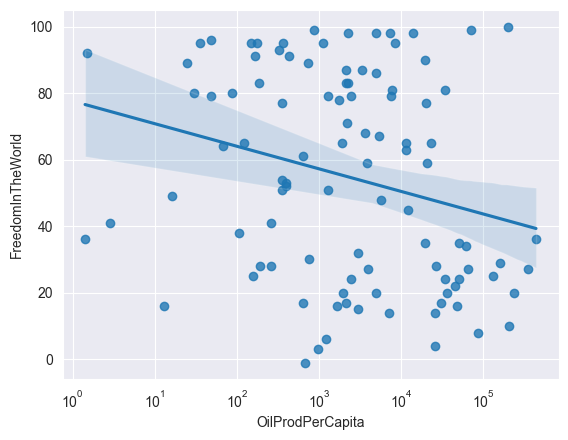
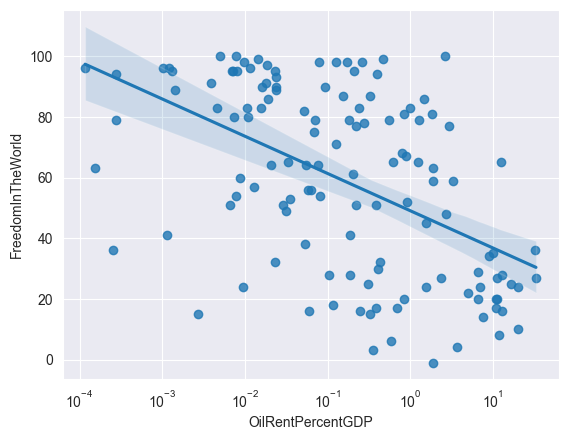
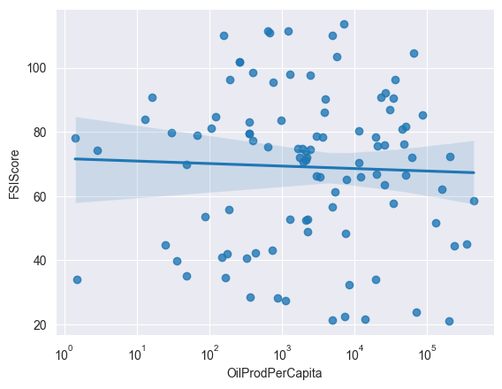
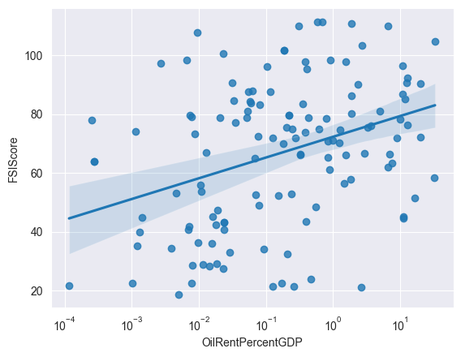

Repository for my 2025 student paper in comparative politics.

Results with 95% confidence interval,

2016 data by:

* Our World in Data ([Oil Production per Capita](https://ourworldindata.org/grapher/oil-prod-per-capita))
* World Bank ([Oil Rent % of GDP](https://data.worldbank.org/indicator/NY.GDP.PETR.RT.ZS))
* Freedom House ([Freedom in the World Index](https://freedomhouse.org/report/freedom-world))
* The Fund for Peace ([Fragile State Index](https://fragilestatesindex.org/))

